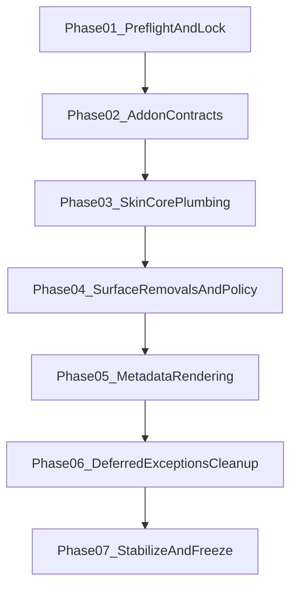

# Execution Roadmap Package

This directory is the implementation control center for the Velocity skin fork.

It translates planning decisions into an execution sequence that a less capable agent can follow with minimal ambiguity.

## Objective

Implement the frozen vision in a contract-first order:

1. lock and validate inputs
2. implement addon contracts
3. migrate skin control-plane wiring
4. remove deprecated surfaces
5. migrate metadata/rendering surfaces
6. resolve deferred exceptions
7. stabilize and freeze

## Operating Principles

- Contract-first migration, not remove-first refactor
- No fallback drift: keep one explicit behavior per surface
- Replace shared plumbing before cosmetic surfaces
- Every phase has binary acceptance gates
- Stop immediately when blocked and report with evidence

## Phase Sequence

## Playbook

Phases **01–06** markdown playbooks were **deleted** from this repository (2026-04-24). Rationale and old step lists live in **git history** only.

- [Phase 07 - Stabilization and Freeze](./phase-07-stabilization-and-freeze.md) — only active execution playbook here

## Guardrail Appendices

- [Agent Guardrails](./appendix-agent-guardrails.md)
- [Verification Checklists](./appendix-verification-checklists.md)
- [Traceability Matrix](./appendix-traceability-matrix.md)
- [Kodi UI verification matrix](./kodi-ui-verification-matrix.md) — code-backed top bar, hub IDs, and Standard widget rows for manual QA in Kodi
- [Kodi complete manual testing guide](../../velocity/kodi-complete-testing-guide.md) — end-to-end operator QA to verify all roadmap phases and close Phase 07 runtime evidence

## Phase Status Tracking (Single Source)

Use this table as the only execution status tracker for roadmap phases. **Actionable backlog** (not historical narrative): [Phase 07 playbook](./phase-07-stabilization-and-freeze.md) (validation status at top), [master triage](../gap-analysis/master-triage-list.md), [D-038](../../velocity/d038-legacy-property-ledger.md).

| Phase | Status | Evidence |
|---|---|---|
| Phase 01 — Preflight and contract lock | completed | playbook deleted |
| Phase 02 — Addon contract implementation | completed | [phase-02-fixtures-mirror.md](./phase-02-fixtures-mirror.md) |
| Phase 03 — Skin core plumbing migration | completed | validation report removed |
| Phase 04 — Skin removal and policy | completed | validation report removed |
| Phase 05 — Metadata and rendering | completed | validation report removed |
| Phase 06 — Deferred exceptions cleanup | completed | validation report removed |
| [Phase 07 - Stabilization and Freeze](./phase-07-stabilization-and-freeze.md) | blocked | Run Kodi QA per [kodi-ui-verification-matrix.md](./kodi-ui-verification-matrix.md); append evidence in **Phase 07 playbook** §Validation status; clear P1 blockers |

## Canonical Source Documents

- [Skin Vision Blueprint v1 (current)](../../target/skin-vision-blueprint-v1.md)
- [Skin Vision Blueprint v0 (historical)](../../archive/skin-vision-blueprint-v0.md)
- List contracts: [theory](../../contracts/README.md) · [target](../../target/LIST_CONTRACTS_TARGET.md) · [status](../../status/LIST_IMPLEMENTATION_STATUS.md)
- [Non-list surface build contract](../../target/screen-by-screen-build-contract.md)
- [D-003 View Mode Matrix](../../target/d003-view-mode-matrix.md)
- [D-038 Legacy Property Ledger](../../velocity/d038-legacy-property-ledger.md)
- [Inventory Root](../../velocity/surfaces/README.md)

## Do / Don't (for less capable agents)

- **Do**
  - use [Phase 07 playbook](./phase-07-stabilization-and-freeze.md) as the only execution playbook here (01–06 playbooks removed)
  - treat contracts (build contract, D-015, D-038) as authoritative for product rules
  - validate after each logical slice
  - update traceability as changes land
- **Don't**
  - skip Phase 07 prerequisites (Kodi runtime, addon installed)
  - mix unrelated refactors into freeze verification
  - infer missing contract details
  - continue after an unresolved blocker

## Global Definition of Done

All conditions must be true:

- Phase 07 freeze checklist and runtime evidence pass; phases 01–06 accepted as **closed in tree** (playbooks removed)
- active surfaces are wired to Velocity/native contracts
- deprecated helper surfaces in approved removal scope are removed
- deferred exceptions are explicitly documented
- traceability matrix links decisions to implementation outputs
- freeze checklist in Phase 07 passes with no unresolved P0/P1 blockers

