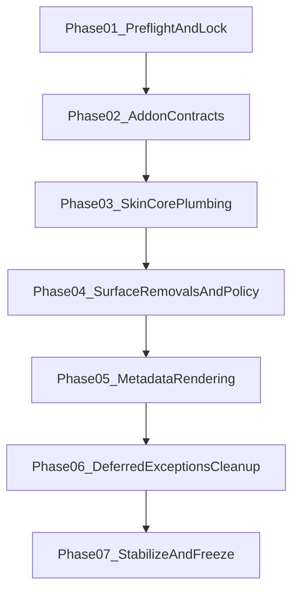

# Execution Roadmap Package

This directory is the implementation control center for the Velocity skin fork.

It translates planning decisions into an execution sequence that a less capable agent can follow with minimal ambiguity.

## Objective

Implement the frozen vision in a contract-first order:

1. lock and validate inputs
2. implement addon contracts
3. migrate skin control-plane wiring
4. remove deprecated surfaces
5. migrate metadata/rendering surfaces
6. resolve deferred exceptions
7. stabilize and freeze

## Operating Principles

- Contract-first migration, not remove-first refactor
- No fallback drift: keep one explicit behavior per surface
- Replace shared plumbing before cosmetic surfaces
- Every phase has binary acceptance gates
- Stop immediately when blocked and report with evidence

## Phase Sequence

## Phase Playbooks

- [Phase 01 - Preflight and Contract Lock](./phase-01-preflight-and-contract-lock.md)
- [Phase 02 - Addon Contract Implementation](./phase-02-addon-contract-implementation.md)
- [Phase 03 - Skin Core Plumbing Migration](./phase-03-skin-core-plumbing-migration.md)
- [Phase 04 - Skin Removal and Policy Enforcement](./phase-04-skin-removal-and-policy-enforcement.md)
- [Phase 05 - Metadata and Rendering Migration](./phase-05-metadata-and-rendering-migration.md)
- [Phase 06 - Deferred Exceptions and Final Cleanup](./phase-06-deferred-exceptions-and-final-cleanup.md)
- [Phase 07 - Stabilization and Freeze](./phase-07-stabilization-and-freeze.md)

## Guardrail Appendices

- [Agent Guardrails](./appendix-agent-guardrails.md)
- [Verification Checklists](./appendix-verification-checklists.md)
- [Traceability Matrix](./appendix-traceability-matrix.md)
- [Kodi UI verification matrix](./kodi-ui-verification-matrix.md) — code-backed top bar, hub IDs, and Standard widget rows for manual QA in Kodi
- [Kodi complete manual testing guide](../kodi-complete-testing-guide.md) — end-to-end operator QA to verify all roadmap phases and close Phase 07 runtime evidence

## Phase Status Tracking (Single Source)

Use this table as the only execution status tracker for roadmap phases.

| Phase | Status | Evidence |
|---|---|---|
| [Phase 01 - Preflight and Contract Lock](./phase-01-preflight-and-contract-lock.md) | completed | [Phase 01 completion note](./phase-01-preflight-and-contract-lock.md) |
| [Phase 02 - Addon Contract Implementation](./phase-02-addon-contract-implementation.md) | completed | [Phase 02 validation report](./phase-02-validation-report.md) |
| [Phase 03 - Skin Core Plumbing Migration](./phase-03-skin-core-plumbing-migration.md) | completed | [Phase 03 validation report](./phase-03-validation-report.md) (static Batch B; runtime hub journeys require operator evidence in same report) |
| [Phase 04 - Skin Removal and Policy Enforcement](./phase-04-skin-removal-and-policy-enforcement.md) | completed | [Phase 04 validation report](./phase-04-validation-report.md) |
| [Phase 05 - Metadata and Rendering Migration](./phase-05-metadata-and-rendering-migration.md) | completed | [Phase 05 validation report](./phase-05-validation-report.md) |
| [Phase 06 - Deferred Exceptions and Final Cleanup](./phase-06-deferred-exceptions-and-final-cleanup.md) | completed | [Phase 06 validation report](./phase-06-validation-report.md); [D-038](../d038-legacy-property-ledger.md) §4 exception list updated |
| [Phase 07 - Stabilization and Freeze](./phase-07-stabilization-and-freeze.md) | blocked | [Phase 07 validation report](./phase-07-validation-report.md) — **blocked:** no Kodi runtime evidence for mandatory end-to-end journeys and D-015 pagination checks; Phase 03 addendum runtime table still empty. Re-run in Kodi per [kodi-ui-verification-matrix.md](./kodi-ui-verification-matrix.md), attach evidence, then set status to **completed** only when all Phase 07 acceptance criteria pass. |

## Canonical Source Documents

- [Skin Vision Blueprint](../skin-vision-blueprint-v0.md)
- [Screen-by-Screen Build Contract](../screen-by-screen-build-contract.md)
- [D-003 View Mode Matrix](../d003-view-mode-matrix.md)
- [D-015 Addon Required Lists Contract](../d015-addon-required-lists-contract.md)
- [D-038 Legacy Property Ledger](../d038-legacy-property-ledger.md)
- [Inventory Root](../../inventory/README.md)

## Do / Don't (for less capable agents)

- **Do**
  - follow phase order strictly
  - use the active phase doc as the only execution source
  - validate after each logical slice
  - update traceability as changes land
- **Don't**
  - skip prerequisites
  - mix tasks from multiple phases in one run
  - infer missing contract details
  - continue after an unresolved blocker

## Global Definition of Done

All conditions must be true:

- all phase acceptance checklists pass
- active surfaces are wired to Velocity/native contracts
- deprecated helper surfaces in approved removal scope are removed
- deferred exceptions are explicitly documented
- traceability matrix links decisions to implementation outputs
- freeze checklist in Phase 07 passes with no unresolved P0/P1 blockers

