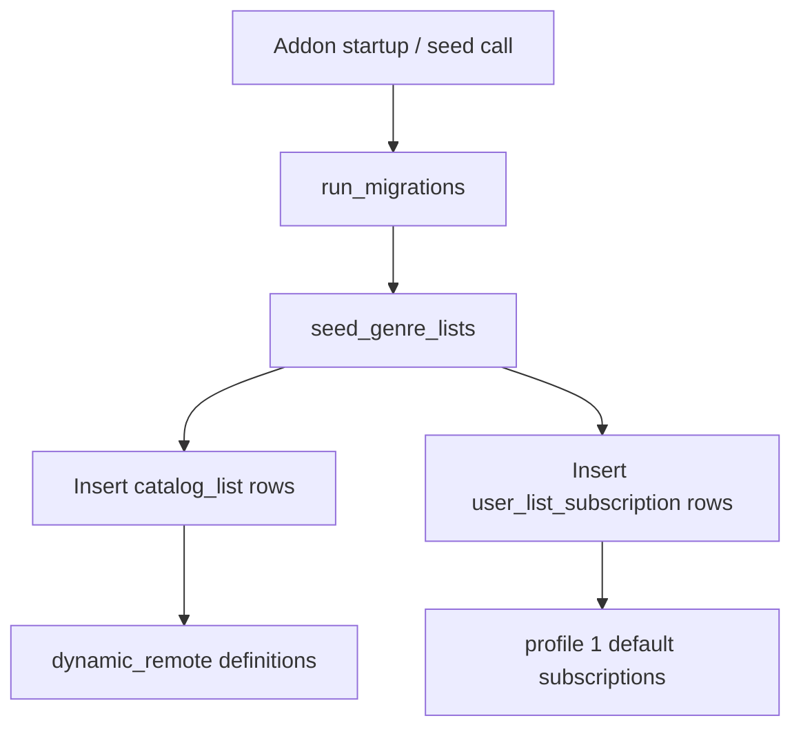
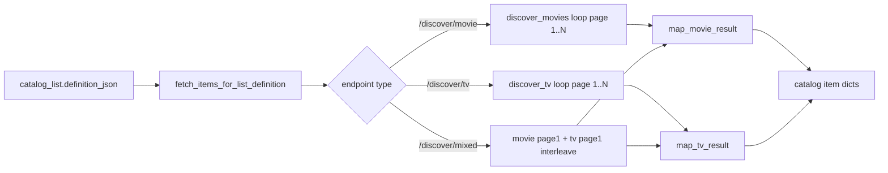
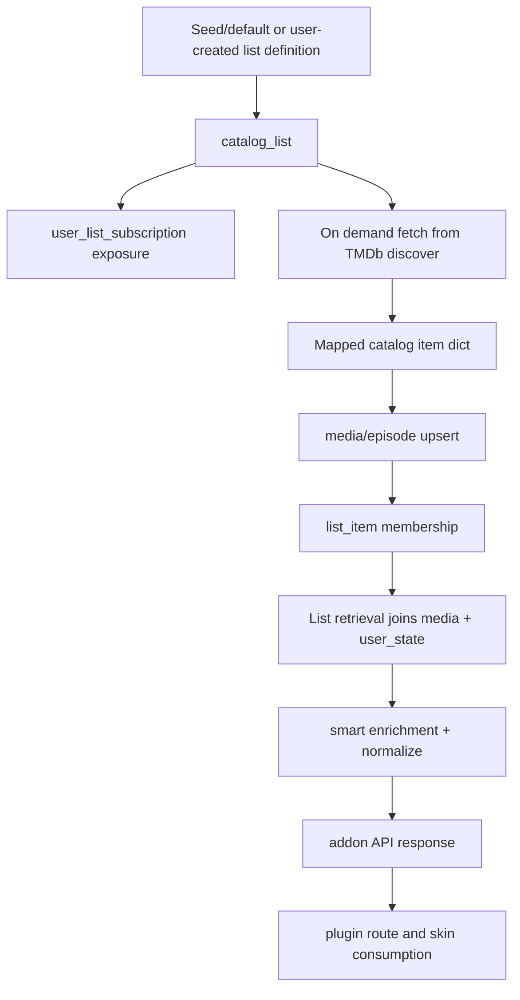

# Velocity Addon Lists and Rails: Creation, Retrieval, Storage, and Exposure

## Scope and Perspective

This report describes how `plugin.video.velocity2` handles:

- list creation and seeding
- list retrieval at addon API and plugin route layers
- upstream data retrieval (TMDb discover)
- storage of list definitions, list items, media metadata, artwork, and user state
- smart rail exposure (locally computed rails)

This is written from the addon's internal point of view (daemon + repo + client layers), not from skin rendering behavior.

---

## 1) High-Level Architecture

```mermaid
flowchart LR
  A[First Boot / Seed] --> B[catalog_list + user_list_subscription]
  B --> C[GET /api/lists/{list_id}]
  C --> D{list_item rows exist?}
  D -- yes --> E[Read media + user_state joins]
  D -- no --> F[Resolve list definition]
  F --> G[TMDb discover fetch]
  G --> H[Map to catalog item dicts]
  H --> I{sync/hydration requested?}
  I -- yes --> J[Upsert media/episode + replace list_item]
  I -- no --> K[Return virtual/live items]
  J --> E
  E --> L[Normalize + expose via addon plugin route]
```

### Core components

| Component | Responsibility |
|---|---|
| `lib/db/seed.py` | Seeds default dynamic remote lists and subscriptions |
| `lib/daemon/api/routes_list.py` | CRUD/list endpoints and dynamic list retrieval |
| `lib/daemon/tmdb_items.py` | Executes definition-based TMDb fetch loops and maps payloads |
| `lib/daemon/hydration.py` | Persists fetched items into local SQLite |
| `lib/repo/lists.py` | List query/join layer (`catalog_list`, `list_item`, subscriptions, state join) |
| `lib/repo/catalog.py` | Upsert/read media and episode rows; artwork-local aware projection |
| `lib/daemon/api/routes_smart.py` | Smart rail endpoints computed from local state |
| `lib/network/client.py` and `lib/network/tmdb_cache_client.py` | TMDb HTTP and persistent response cache |

---

## 2) Default List Creation (Seeded)

### 2.1 First-boot seed flow



### 2.2 Seeded default list families

| Family | Count | ID pattern | Definition pattern | Purpose |
|---|---:|---|---|---|
| Movie genre lists | 19 | `genre-movie-{tmdb_genre_id}` | `endpoint=/discover/movie`, `params.with_genres={id}`, `sort_by=popularity.desc` | Browse movie genres |
| TV genre lists | 16 | `genre-tv-{tmdb_genre_id}` | `endpoint=/discover/tv`, `params.with_genres={id}`, `sort_by=popularity.desc` | Browse TV genres |
| Spotlight defaults | 3 | fixed IDs | `home_spotlight_mixed`, `series_spotlight_trending`, `movies_spotlight_trending` | Spotlight rails for home/series/movies |

### 2.3 Seeded definition payload shape

| Field | Example | Notes |
|---|---|---|
| `endpoint` | `/discover/movie` | Routed to TMDb discover handlers |
| `params` | `{"with_genres":"28","sort_by":"popularity.desc"}` | Passed to discover call kwargs |
| `sync_to_library` | `true` | Hydration policy for sync workflows |
| `media_type` | `movie` / `tv` / `mixed` | Controls mapper and mixed behavior |
| `seed_source` | `genre` / `spotlight` | Used to classify/filter seeded lists |

### 2.4 Storage written at creation time

| Table | Key columns written | Stored content |
|---|---|---|
| `catalog_list` | `internal_id`, `name`, `list_type`, `definition_json`, `art_json` | Canonical list definition and metadata |
| `user_list_subscription` | `profile_id`, `list_id`, `is_pinned`, `row_order`, `sync_mode` | Per-profile list exposure config |

---

## 3) List Retrieval: Addon API and Plugin Route

### 3.1 Retrieval flow (`GET /api/lists/{list_id}`)

```mermaid
flowchart TD
  A[GET /api/lists/{list_id}?profile&page] --> B[Check in-memory list cache]
  B -->|hit| C[Return cached response]
  B -->|miss| D[Load list_item rows for profile]
  D --> E{rows found?}
  E -->|yes| F[Join media + user_state and paginate]
  E -->|no| G[Load catalog_list.definition]
  G --> H{dynamic local / preset / endpoint+params}
  H --> I[Fetch live items]
  I --> J[Annotate virtual items]
  F --> K[Normalize for skin]
  J --> K
  K --> L[Cache response + return]
```

### 3.2 Request interfaces

| Surface | Request | Function |
|---|---|---|
| Daemon list endpoint | `GET /api/lists/{list_id}?profile=1&page=1&enrich=limited` | Returns `items`, `page`, `has_more`, optional `next_page` |
| Kodi plugin route | `plugin://plugin.video.velocity2/?action=list&list_id={list_id}&page=1` | Client-facing route that delegates to daemon list retrieval |

### 3.3 Data requested internally during list retrieval

| Step | Requested data | Source |
|---|---|---|
| Subscription/list resolution | `catalog_list.definition_json`, list metadata | `catalog_list` |
| Stored list items | `list_item.media_id`, `rank` | `list_item` |
| Item metadata/artwork | title, ids, `metadata_json`, local+remote art columns | `media` |
| Watch/progress overlay | `completed`, `is_watched`, `play_history_json` | `user_state` |
| Missing list fallback | definition-based live discover results | TMDb via daemon fetch layer |

---

## 4) Upstream Data Retrieval (TMDb) from Definitions

### 4.1 Definition-driven remote fetch flow



### 4.2 Exact upstream request patterns

| List type | TMDb request pattern |
|---|---|
| Genre movie list | `GET https://api.themoviedb.org/3/discover/movie?language=en-US&sort_by=popularity.desc&with_genres={genre_id}&page={1..6}` |
| Genre TV list | `GET https://api.themoviedb.org/3/discover/tv?language=en-US&sort_by=popularity.desc&with_genres={genre_id}&page={1..6}` |
| Spotlight movie | `GET https://api.themoviedb.org/3/trending/movie/week` |
| Spotlight TV | `GET https://api.themoviedb.org/3/trending/tv/week` |
| Spotlight mixed | `GET /3/trending/movie/week` + `GET /3/trending/tv/week`, then interleave item arrays |

Auth behavior:

- Uses Bearer token header when configured.
- Otherwise sends `api_key` query parameter.
- Uses `language=en-US` on discover requests.

### 4.3 Requested vs received payloads

| Layer | Requested fields/params | Received payload used |
|---|---|---|
| Discover request | `sort_by`, `with_genres`, `with_watch_providers`, `page`, `language` | `results[]` array from TMDb response |
| Movie mapper | TMDb movie result object | `internal_id=movie-{id}`, art URLs, metadata (`plot`, `year`, `rating`, `genre`, etc.), identifiers |
| TV mapper | TMDb TV result object | `internal_id=tv-{id}`, art URLs, metadata (`premiered`, `totalepisodes`, `status`, etc.), identifiers |

---

## 5) Hydration and Local Persistence of Retrieved Items

### 5.1 Hydration write path

```mermaid
flowchart TD
  A[Definition fetch returns catalog item dicts] --> B[localize_art_dict]
  B --> C[upsert_media_from_catalog_items]
  C --> D[upsert media rows]
  C --> E[upsert episode rows when episode IDs]
  D --> F[replace_list_items(list_id, media_ids by rank)]
  E --> F
  F --> G[List now fully local for subsequent reads]
```

### 5.2 Storage tables and what they keep

| Table | Primary role | Key columns used in list/rail pipeline |
|---|---|---|
| `catalog_list` | Persist list definitions | `internal_id`, `name`, `list_type`, `definition_json`, `art_json` |
| `user_list_subscription` | Exposure config per profile | `profile_id`, `list_id`, `is_pinned`, `row_order`, `sync_mode` |
| `list_item` | Ordered membership of items in a list | `list_id`, `media_id`, `rank` |
| `media` | Canonical movie/tv rows + art + metadata | IDs, title/year, `metadata_json`, remote+local art columns |
| `episode` | Episode-specific catalog rows | `show_id`, season/episode numbers, still art, metadata |
| `user_state` | Progress/watch overlays | `position_seconds`, `duration_seconds`, `completed`, `is_watched`, `play_history_json` |
| `tmdb_cache` | Cached TMDb HTTP responses | request-keyed JSON body + TTL |

### 5.3 Local artwork storage columns (migration 002)

| Entity | Remote columns | Local columns | Structured payload |
|---|---|---|---|
| `media` | `poster_url`, `fanart_url` | `poster_local`, `fanart_local`, `thumb_local`, `clearlogo_local`, `landscape_local`, `clearart_local` | `art_json`, `artwork_updated_ts` |
| `episode` | `still_url` | `still_local` | `art_json`, `artwork_updated_ts` |

---

## 6) Smart Rail Exposure (Local-first rails)

Smart rails are exposed from `routes_smart.py`, computed from local repo state and user behavior data.

### 6.1 Smart rail exposure flow

```mermaid
flowchart LR
  A[GET /api/lists/smart/{type}] --> B[rails SQL query module]
  B --> C[Items from local media/episode/user_state]
  C --> D[enrich_smart_playlist_items]
  D --> E[Lazy local artwork localization]
  E --> F[Normalize and return items page=1]
```

### 6.2 Rail endpoints and data basis

| Rail | Endpoint | Primary local basis |
|---|---|---|
| Continue Watching | `/api/lists/smart/continue_watching` | In-progress playback/user-state rows |
| Recently Watched | `/api/lists/smart/recently_watched` | Recent completion/watch state |
| Up Next | `/api/lists/smart/up_next` | Continue-watching style source |
| Active Shows | `/api/lists/smart/active_shows` | Show-level engagement/activity |
| New Episodes | `/api/lists/smart/new_episodes` | Episode rows constrained by air-date window |
| In Progress Movies | `/api/lists/smart/in_progress_movies` | Movie progress state |

### 6.3 Requested and returned data points for rails

| Stage | Requested data points | Returned item fields |
|---|---|---|
| Rail query | profile id, progress/watch state, media/episode linkage, dates | internal IDs + base item rows |
| Enrichment | metadata completion and art resolution | normalized `metadata`, `art`, identifiers |
| Final response | page contract | `{items:[...], page:1, has_more:false}` |

---

## 7) List and Rail Contract Surfaces

| Contract surface | Description |
|---|---|
| `GET /api/lists/home` | Returns pinned subscription lists (`user_list_subscription.is_pinned=1`) |
| `GET /api/lists/genres?kind=movie|tv` | Returns seeded genre dynamic-remote lists filtered by `seed_source=genre` |
| `GET /api/lists/{list_id}` | Primary list retrieval (stored list first, fallback definition fetch) |
| `GET /api/lists/smart/*` | Local smart rail exposure endpoints |
| `POST /api/lists/{list_id}/sync` | Hydrates/syncs supported lists into local store |

---

## 8) End-to-End Data Lineage (Creation to Exposure)



---

## 9) Practical Notes for Validation

| Validation goal | What to inspect |
|---|---|
| Confirm default list creation | `catalog_list` rows for `genre-*` and `*_spotlight_*`, plus `user_list_subscription` rows for profile 1 |
| Confirm retrieval fallback | Call `GET /api/lists/{list_id}` for list without `list_item` rows and verify live fetch path |
| Confirm hydration persistence | Run sync, then verify `media`, `episode`, and `list_item` population |
| Confirm local-first art behavior | Check `*_local` art columns and returned item `art` precedence |
| Confirm smart rail exposure | Hit each `/api/lists/smart/*` endpoint and verify `page=1, has_more=false` and expected item population |

---

## 10) Summary

Velocity's addon architecture is local-first at the list contract layer:

- list definitions are persisted locally (`catalog_list`)
- list membership is persisted locally (`list_item`) when hydrated
- item metadata and artwork are persisted in `media`/`episode` with local artwork columns
- watch/progress behavior overlays from `user_state`
- smart rails are exposed directly from local state queries
- TMDb discover is the upstream data source for dynamic remote lists and first-fill operations

This creates a deterministic retrieval contract for the skin/plugin route even when upstream calls are transient or deferred.

---

## 11) Appendix: Complete Seeded List Inventory (Default)

This appendix lists all default seeded `dynamic_remote` lists created by `seed_genre_lists()`.

### 11.1 Spotlight defaults (3)

| list_id | name | endpoint | params | upstream request template |
|---|---|---|---|---|
| `home_spotlight_mixed` | Home Spotlight | `/trending/mixed` | `{"time_window":"week"}` | `GET /3/trending/movie/week` + `GET /3/trending/tv/week` (interleaved) |
| `series_spotlight_trending` | Series Spotlight | `/trending/tv` | `{"time_window":"week"}` | `GET /3/trending/tv/week` |
| `movies_spotlight_trending` | Movies Spotlight | `/trending/movie` | `{"time_window":"week"}` | `GET /3/trending/movie/week` |

### 11.2 Movie genre seeded lists (19)

Common request template:

- `GET https://api.themoviedb.org/3/discover/movie?language=en-US&sort_by=popularity.desc&with_genres={genre_id}&page={1..6}`

| list_id | name | genre_id | endpoint | params |
|---|---|---:|---|---|
| `genre-movie-28` | Action (Movies) | 28 | `/discover/movie` | `{"with_genres":"28","sort_by":"popularity.desc"}` |
| `genre-movie-12` | Adventure (Movies) | 12 | `/discover/movie` | `{"with_genres":"12","sort_by":"popularity.desc"}` |
| `genre-movie-16` | Animation (Movies) | 16 | `/discover/movie` | `{"with_genres":"16","sort_by":"popularity.desc"}` |
| `genre-movie-35` | Comedy (Movies) | 35 | `/discover/movie` | `{"with_genres":"35","sort_by":"popularity.desc"}` |
| `genre-movie-80` | Crime (Movies) | 80 | `/discover/movie` | `{"with_genres":"80","sort_by":"popularity.desc"}` |
| `genre-movie-99` | Documentary (Movies) | 99 | `/discover/movie` | `{"with_genres":"99","sort_by":"popularity.desc"}` |
| `genre-movie-18` | Drama (Movies) | 18 | `/discover/movie` | `{"with_genres":"18","sort_by":"popularity.desc"}` |
| `genre-movie-10751` | Family (Movies) | 10751 | `/discover/movie` | `{"with_genres":"10751","sort_by":"popularity.desc"}` |
| `genre-movie-14` | Fantasy (Movies) | 14 | `/discover/movie` | `{"with_genres":"14","sort_by":"popularity.desc"}` |
| `genre-movie-36` | History (Movies) | 36 | `/discover/movie` | `{"with_genres":"36","sort_by":"popularity.desc"}` |
| `genre-movie-27` | Horror (Movies) | 27 | `/discover/movie` | `{"with_genres":"27","sort_by":"popularity.desc"}` |
| `genre-movie-10402` | Music (Movies) | 10402 | `/discover/movie` | `{"with_genres":"10402","sort_by":"popularity.desc"}` |
| `genre-movie-9648` | Mystery (Movies) | 9648 | `/discover/movie` | `{"with_genres":"9648","sort_by":"popularity.desc"}` |
| `genre-movie-10749` | Romance (Movies) | 10749 | `/discover/movie` | `{"with_genres":"10749","sort_by":"popularity.desc"}` |
| `genre-movie-878` | Science Fiction (Movies) | 878 | `/discover/movie` | `{"with_genres":"878","sort_by":"popularity.desc"}` |
| `genre-movie-10770` | TV Movie (Movies) | 10770 | `/discover/movie` | `{"with_genres":"10770","sort_by":"popularity.desc"}` |
| `genre-movie-53` | Thriller (Movies) | 53 | `/discover/movie` | `{"with_genres":"53","sort_by":"popularity.desc"}` |
| `genre-movie-10752` | War (Movies) | 10752 | `/discover/movie` | `{"with_genres":"10752","sort_by":"popularity.desc"}` |
| `genre-movie-37` | Western (Movies) | 37 | `/discover/movie` | `{"with_genres":"37","sort_by":"popularity.desc"}` |

### 11.3 TV genre seeded lists (16)

Common request template:

- `GET https://api.themoviedb.org/3/discover/tv?language=en-US&sort_by=popularity.desc&with_genres={genre_id}&page={1..6}`

| list_id | name | genre_id | endpoint | params |
|---|---|---:|---|---|
| `genre-tv-10759` | Action & Adventure (TV) | 10759 | `/discover/tv` | `{"with_genres":"10759","sort_by":"popularity.desc"}` |
| `genre-tv-16` | Animation (TV) | 16 | `/discover/tv` | `{"with_genres":"16","sort_by":"popularity.desc"}` |
| `genre-tv-35` | Comedy (TV) | 35 | `/discover/tv` | `{"with_genres":"35","sort_by":"popularity.desc"}` |
| `genre-tv-80` | Crime (TV) | 80 | `/discover/tv` | `{"with_genres":"80","sort_by":"popularity.desc"}` |
| `genre-tv-99` | Documentary (TV) | 99 | `/discover/tv` | `{"with_genres":"99","sort_by":"popularity.desc"}` |
| `genre-tv-18` | Drama (TV) | 18 | `/discover/tv` | `{"with_genres":"18","sort_by":"popularity.desc"}` |
| `genre-tv-10751` | Family (TV) | 10751 | `/discover/tv` | `{"with_genres":"10751","sort_by":"popularity.desc"}` |
| `genre-tv-10762` | Kids (TV) | 10762 | `/discover/tv` | `{"with_genres":"10762","sort_by":"popularity.desc"}` |
| `genre-tv-9648` | Mystery (TV) | 9648 | `/discover/tv` | `{"with_genres":"9648","sort_by":"popularity.desc"}` |
| `genre-tv-10763` | News (TV) | 10763 | `/discover/tv` | `{"with_genres":"10763","sort_by":"popularity.desc"}` |
| `genre-tv-10764` | Reality (TV) | 10764 | `/discover/tv` | `{"with_genres":"10764","sort_by":"popularity.desc"}` |
| `genre-tv-10765` | Sci-Fi & Fantasy (TV) | 10765 | `/discover/tv` | `{"with_genres":"10765","sort_by":"popularity.desc"}` |
| `genre-tv-10766` | Soap (TV) | 10766 | `/discover/tv` | `{"with_genres":"10766","sort_by":"popularity.desc"}` |
| `genre-tv-10767` | Talk (TV) | 10767 | `/discover/tv` | `{"with_genres":"10767","sort_by":"popularity.desc"}` |
| `genre-tv-10768` | War & Politics (TV) | 10768 | `/discover/tv` | `{"with_genres":"10768","sort_by":"popularity.desc"}` |
| `genre-tv-37` | Western (TV) | 37 | `/discover/tv` | `{"with_genres":"37","sort_by":"popularity.desc"}` |

### 11.4 Complete seeded total

| Category | Count |
|---|---:|
| Spotlight defaults | 3 |
| Movie genre defaults | 19 |
| TV genre defaults | 16 |
| **Total seeded defaults** | **38** |

---

## 12) Contract Alignment Matrix (Skin vs D-015)

This section tracks what the skin actually calls today and how that aligns to
[`../target/d015-addon-required-lists-contract.md`](../target/d015-addon-required-lists-contract.md).

Legend:
- **Used**: actively referenced by skin routes in current XML.
- **Not used**: contract exists in D-015 but is not referenced by current skin routes.
- **Missing**: required by D-015 but not present as a dedicated contract route in current implementation.
- **Out of D-015 scope**: route is used by skin but is not a D-015 list contract ID.

### 12.1 D-015 contracts currently used by skin

| Contract ID | D-015 section | Current status |
|---|---|---|
| `home_spotlight_mixed` | Home | Used |
| `home_in_progress_series` | Home | Used |
| `home_in_progress_movies` | Home | Used |
| `series_spotlight_trending` | Series | Used |
| `series_continue_watching_episodes` | Series | Used |
| `series_in_progress_shows` | Series | Used |
| `series_global_trending` | Series | Used |
| `series_provider_icons` | Series | Used |
| `movies_spotlight_trending` | Movies | Used |
| `movies_in_progress` | Movies | Used |
| `movies_global_trending` | Movies | Used |
| `movies_provider_icons` | Movies | Used |

### 12.2 D-015 contracts not currently wired by skin

| Contract group | D-015 section | Current status |
|---|---|---|
| `provider_{provider_id}_{media}_spotlight` | Provider mini-hubs | Not used |
| `provider_{provider_id}_{media}_trending` | Provider mini-hubs | Not used |
| `provider_{provider_id}_{media}_popular` | Provider mini-hubs | Not used |
| `provider_{provider_id}_{media}_genre_{genre}` | Provider mini-hubs | Not used |
| `genre_global_*` | Global genre discovery | Not used (skin uses `action=browse_genres`) |
| `search_movies` | Search | Not used |
| `search_tvshows` | Search | Not used |

### 12.3 Skin-used rails/routes outside D-015 list IDs

These are used in skin routing but are not modeled as D-015 list contract IDs.

| Route/rail | Current status | Notes |
|---|---|---|
| `action=discover` | Used | Used as row items; discovery action route, not a list_id contract |
| `action=browse_genres&kind=tv` | Used | Genre entry route, not explicit `genre_global_*` contract ID |
| `action=browse_genres&kind=movie` | Used | Genre entry route, not explicit `genre_global_*` contract ID |
| Smart rails (`continue_watching`, `recently_watched`, `up_next`, `active_shows`, `new_episodes`, `in_progress_movies`) | Partially used outside core hubs | Still used in non-core/legacy surfaces (for example next-aired, OSD, path helpers), but no longer used in core Home/1101/1102 contract rows |

### 12.4 Key discrepancy summary

1. **Old alias mapping is obsolete**  
   Current core hub wiring now calls explicit D-015 contract IDs directly (for example `series_in_progress_shows`, `movies_global_trending`) instead of aliasing to smart rails.

2. **Provider mini-hub contract families remain unimplemented/unwired**  
   D-015 defines them, but current skin wiring intentionally does not consume them in this hard-replacement pass.

3. **Genre/search contract IDs vs action routes**  
   D-015 lists explicit `genre_global_*`, `search_movies`, and `search_tvshows` contracts; current skin uses `browse_genres` and `discover` routes instead.
