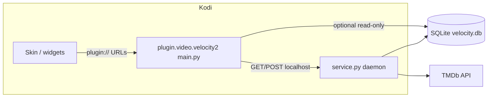

# Velocity 2.0 addon — reference for skin forks & AI agents

**Purpose:** This document is the **primary context** for building or adapting a Kodi skin (e.g. an Arctic Fuse 3 fork) that targets **only** `plugin.video.velocity2`. Use it when the skin project lives in a **separate repository** from the addon.

**Audience:** Developers and coding agents who need accurate behavior, URL contracts, and HTTP APIs without reading the whole Python tree.

**Companion docs:** Skin-specific phased work: [`af3-skin-fork-roadmap.md`](af3-skin-fork-roadmap.md). Open addon work: [`outstanding-work.md`](outstanding-work.md). **Cursor rules pack** (copy into the skin repo): [`cursor-rules-for-skin-fork/README.md`](cursor-rules-for-skin-fork/README.md).

---

## Table of contents

1. [Addon identity](#1-addon-identity)
2. [Architecture overview](#2-architecture-overview)
3. [Processes & configuration](#3-processes--configuration)
4. [Plugin URL contract (`plugin://`)](#4-plugin-url-contract-plugin)
5. [Internal IDs & media types](#5-internal-ids--media-types)
6. [What the skin sees: `ListItem` behavior](#6-what-the-skin-sees-listitem-behavior)
7. [Pagination & list feeds](#7-pagination--list-feeds)
8. [HTTP API (daemon) — full route map](#8-http-api-daemon--full-route-map)
9. [Client read paths: `ClientRepo` vs daemon](#9-client-read-paths-clientrepo-vs-daemon)
10. [Playback](#10-playback)
11. [Watch state, progress, and Up Next](#11-watch-state-progress-and-up-next)
12. [TMDb credentials gate](#12-tmdb-credentials-gate)
13. [Error JSON contract](#13-error-json-contract)
14. [Skin integration guidelines](#14-skin-integration-guidelines)
15. [Source file map](#15-source-file-map)

---

## 1. Addon identity

| Field | Value |
|--------|--------|
| **Addon ID** | `plugin.video.velocity2` |
| **Name** | Velocity 2.0 |
| **Kodi extension** | `xbmc.python.pluginsource` → `main.py` (video plugin UI) |
| **Service** | `xbmc.service` → `service.py` (daemon, starts at Kodi startup) |
| **License** | GPL-3.0-only (per `addon.xml`) |

**Important:** Always build plugin URLs with the **runtime** addon id (`xbmcaddon.Addon().getAddonInfo('id')`) if you fork the addon with a new id. Internally, `lib/config.py` defaults to `plugin.video.velocity2`.

**Declared dependencies** (`addon.xml`):

- `xbmc.python` ≥ 3.0.0  
- `script.module.requests` ≥ 2.25.1  
- `script.service.upnext` ≥ 1.1.0 (**optional**) — used for binge “Up Next” handoff when installed  

Velocity does **not** require TMDbHelper or ExtendedInfo as dependencies; navigation is first-party plugin paths.

---

## 2. Architecture overview

Velocity uses a **thin Kodi client** + **thick local daemon** pattern:

- **Client** (`main.py` → `lib/client/`): parses `plugin://` query args, builds directories with `xbmcplugin`, constructs `xbmcgui.ListItem` via `build_list_item`, and calls the daemon over **HTTP** for writes and for reads when SQLite is unavailable.
- **Daemon** (`service.py` → `lib/daemon/`): **aiohttp** app on `127.0.0.1` + configurable port (default **65432**). Owns SQLite writes, TMDb hydration, schedulers, playback resolution, and REST JSON APIs.



- **Direct DB reads:** `lib/client/repo.py` (`ClientRepo`) opens the shared DB read-only for hot paths (home lists, smart rails, list pages) to avoid HTTP latency when the file exists.

---

## 3. Processes & configuration

| Setting (key) | Role | Default |
|----------------|------|---------|
| `daemon_port` | HTTP port for daemon | `65432` |
| `database_path` | Folder containing `velocity.db` | `special://profile/addon_data/plugin.video.velocity2/` |
| `page_limit` | Items per page for paged catalog lists | `20` in [`resources/settings.xml`](../resources/settings.xml); `lib/config.py::get_page_limit()` falls back to `5` if the setting is missing |
| `tmdb_api_key` / `tmdb_bearer_token` | TMDb v3 key or v4 read token | empty until user sets |

**Host:** Client always talks to `http://127.0.0.1:{daemon_port}` (`lib/client/router.py`, `lib/client/api.py`).

---

## 4. Plugin URL contract (`plugin://`)

Base shape:

```text
plugin://plugin.video.velocity2/?action=<name>&...
```

Query parsing: `lib/client/router.py::parse_args` reads `sys.argv` after the optional numeric plugin handle; supports `key=value` pairs. **`paginate`** is normalized to boolean (`true`/`1`/`yes`).

**Authoritative dispatch:** `lib/client/handlers/dispatch.py::run_client`.

### 4.1 Directory-building actions (folders or playable items)

| `action` | Required params | Notes |
|----------|-----------------|--------|
| *(empty / unknown)* | — | Falls through to **`handle_home()`** |
| `home` | — | Home hub: smart shortcuts + pinned lists + discovery entry points |
| `movies_hub` | — | Movies sub-hub |
| `tv_hub` | — | TV sub-hub |
| `browse_genres` | `kind=movie` or `kind=tv` | Genre list folders |
| `list` | `list_id`, optional `page` (default 1) | Catalog list; may append **Next Page >>** when API returns `next_page` |
| `smart_list` | `type=<see below>` | Smart rails (continue watching, etc.) |
| `discovery` or `discover` | optional `preset_id` | Without `preset_id`: discovery hub; with: preset preview folder |
| `discovery_cat` | `cat_id` | Discovery category |
| `my_lists` | — | User subscriptions / lists UI |
| `my_collections` | — | Collections UI |
| `search_hub` | — | Search history + “new search” |
| `execute_search` | `q` | Run search with query string |
| `search` | — | Opens dialog then search (legacy flow) |
| `view_show` | `id=<show internal id>` | Seasons for a show (e.g. `tv-12345`) |
| `view_season` | `show_id`, `season` | Episodes for one season |

### 4.2 `smart_list` — `type` values

Handled in `lib/client/handlers/smart_lists.py` (repo-first, then `VelocityApi.get_smart_list`).

| `type` | Meaning | Smart API path (fallback) |
|--------|---------|----------------------------|
| `up_next`, `in_progress_episodes`, `continue_watching` | Continue watching rail | `/api/lists/smart/continue_watching` |
| `active_shows` | My TV shows | `/api/lists/smart/active_shows` |
| `new_episodes` | New episodes (window from settings) | `/api/lists/smart/new_episodes` |
| `in_progress_movies`, `movies_in_progress` | In-progress movies | `/api/lists/smart/in_progress_movies` |
| `recent`, `recently_watched` | Recently watched | `/api/lists/smart/recently_watched` |

`lib/client/api.py::get_smart_list` maps the same `kind` strings to paths (align with `lib/daemon/api/routes_smart.py`).

### 4.3 Non-directory / `RunPlugin` style actions

| `action` | Params | Behavior |
|----------|--------|----------|
| `play` | `id=<internal_id>` | Resolve URL via daemon → `setResolvedUrl` or `Player.play` |
| `select` | `id=<internal_id>` | Same as `play` (source selection / resolve pipeline) |
| `toggle_watched` | `id`, `media_type`, `completed` | Watch state |
| `refresh_metadata` | `id` | Refresh |
| `import_item` | `tmdb_id`, `media_type` | Import from TMDb |
| `sync_list` | `list_id` | Sync list |
| `toggle_pin` | `list_id`, `pinned` | Pin list |
| `delete_sub` | `list_id` | Unsubscribe |
| `delete_created_list` | `list_id` | Delete user-created list |
| `delete_custom_list` | `list_id` | Delete custom list |
| `add_to_custom_list`, `create_custom_list`, `join_custom_list`, `remove_from_custom_list`, `subscribe_list` | various | Router dialog/POST flows |
| `discovery_pick` | `preset_id` | Preset choice handler |
| `smart_wizard` | — | Wizard (requires TMDb) |
| `settings_clear_cache` | — | Clear image cache |
| `settings_wipe_db` | — | Wipe DB |
| `settings_select_player` | — | Player profile UI |

---

## 5. Internal IDs & media types

Defined in `lib/media/ids.py` and used across repo/API/UI.

| Pattern | Meaning |
|---------|---------|
| `movie-<tmdb_id>` | Movie |
| `tv-<tmdb_id>` | TV show |
| `tv-<id>-s<season>e<episode>` | Episode |
| `tv-<id>-s<season>` | Season synthetic id (where used) |

`lib/client/builder.py` infers `media_type` from `internal_id` when missing.

**Show IDs** in URLs often look like `tv-94997` (TMDb TV id embedded after `tv-`).

---

## 6. What the skin sees: `ListItem` behavior

**Builder:** `lib/client/builder.py::build_list_item`.

- **Art:** `poster`, `fanart`, `clearlogo`, `landscape`, `clearart`; fallbacks (e.g. landscape from fanart; thumb from poster).
- **Info:** `video` info dict from `metadata` — title, plot/overview, year, premiered, rating, votes, studio, mpaa; episodes get `season`/`episode` ints; `mediatype` is `movie`, `episode`, or `tvshow` for shows.
- **Playable:** `IsPlayable` `true` for movies/episodes (unless unaired episode policy greys them out); folders `false`.
- **Property:** `WidgetTarget` = `video` on playable items (AF-style widgets may use this).
- **Context menu:** Source select, go to show, watched toggles, refresh, import for virtual items, custom list actions — implemented in builder.

Skins should **not** assume TMDbHelper-specific `ListItem.Property` names unless you add them in a fork; Velocity uses standard art + info fields.

---

## 7. Pagination & list feeds

- **Catalog lists** (`action=list`): `lib/client/handlers/lists.py` loads items from `ClientRepo.get_list` or `GET /api/lists/{list_id}` with `profile`, `page`.
- **Response shape:** `{ "items": [...], "next_page": <int|null> }` from `lib/daemon/api/routes_list.py::get_list_handler`.
- **UI:** If `next_page` is set, a synthetic folder item **“Next Page >>”** is added (`build_next_page_item`), pointing to `?action=list&list_id=...&page=<next_page>`.

**Implication for skins:** Spotlight/widget feeds that reuse the same `list` path may show **Next Page** unless you use a skin-specific path with a future `paginate=false` contract (see [`af3-skin-fork-roadmap.md`](af3-skin-fork-roadmap.md) Phase 2).

**Smart rails:** HTTP handlers return `next_page: null` (`lib/daemon/api/routes_smart.py`).

**Sort order:** `lib/client/handlers/common.py::_end_directory_preserve_order` uses playlist order so directory order matches provider order.

---

## 8. HTTP API (daemon) — full route map

Base URL: `http://127.0.0.1:{daemon_port}`.  
Registration is split across `lib/daemon/api/routes_*.py`.

### Lists & subscriptions

| Method | Path | Purpose |
|--------|------|---------|
| GET | `/api/lists/home` | Pinned home lists |
| GET | `/api/lists/subscriptions` | Subscriptions |
| POST | `/api/lists/subscribe` | Subscribe |
| GET | `/api/lists/genres?kind=movie|tv` | Genre list folders |
| GET | `/api/lists/{list_id}` | Paged list items (`page`, `profile`, `enrich`) |
| POST | `/api/lists/import` | Import preset list |
| POST | `/api/lists/create` | Create list (legacy / wizard / dynamic) |
| POST | `/api/lists/{list_id}/sync` | Sync list |
| PATCH | `/api/lists/subscriptions/{list_id}` | e.g. pin |
| DELETE | `/api/lists/subscriptions/{list_id}` | Unsubscribe |
| DELETE | `/api/lists/created/{list_id}` | Delete user-created catalog list |

### Custom lists

| Method | Path | Purpose |
|--------|------|---------|
| GET | `/api/lists/custom` | List custom lists |
| GET | `/api/lists/custom/{list_id}` | One custom list |
| POST | `/api/lists/custom` | Create |
| POST | `/api/lists/custom/{list_id}/items` | Add/remove items |
| DELETE | `/api/lists/custom/{list_id}` | Delete |

### Smart rails

| Method | Path |
|--------|------|
| GET | `/api/lists/smart/continue_watching` |
| GET | `/api/lists/smart/recently_watched` |
| GET | `/api/lists/smart/up_next` |
| GET | `/api/lists/smart/active_shows` |
| GET | `/api/lists/smart/new_episodes` |
| GET | `/api/lists/smart/in_progress_movies` |
| POST | `/api/lists/dynamic/evaluate` | Evaluate dynamic-local rules |

Query params often include `profile=1` (see handlers).

### Discovery

| Method | Path |
|--------|------|
| GET | `/api/discovery/categories` |
| GET | `/api/discovery/presets` |
| GET | `/api/discovery/preview/{preset_id}` |
| GET | `/api/discovery/search` |
| GET | `/api/discovery/search/history` |

### Search (global)

| Method | Path |
|--------|------|
| GET | `/api/search?q=...` |

### Media

| Method | Path | Purpose |
|--------|------|---------|
| POST | `/api/media/show/{id}/sync_catalog` | Backfill show catalog |
| POST | `/api/media/show/{id}/season/{season}/sync_catalog` | Backfill one season |
| GET | `/api/media/show/{id}/seasons` | Season list |
| GET | `/api/media/show/{id}/season/{season}` | Episodes |
| POST | `/api/media/{internal_id}/refresh` | Refresh metadata |
| PATCH | `/api/media/{id}/state` | User state |
| GET | `/api/media/{id}/watch_aggregate` | Watch aggregate |
| POST | `/api/media/import` | Import |

### Playback

| Method | Path |
|--------|------|
| POST | `/api/playback/status` | Progress / watched (player monitor) |
| POST | `/api/playback/resolve` | Resolve playable URL from `internal_id` |

### System

| Method | Path |
|--------|------|
| GET | `/api/system/settings` | Expose settings to UI |
| DELETE | `/api/system/database` | Wipe DB |
| GET | `/api/tasks/{task_id}` | Background task status |

---

## 9. Client read paths: `ClientRepo` vs daemon

- **`lib/client/repo.py` (`ClientRepo`):** Read-only SQLite access to the same DB file as the daemon (WAL-friendly). Used for home, lists, smart rails, search history, seasons, etc., when the file is present.
- **Fallback:** If DB missing or read fails, handlers use `Router.get_json` / `VelocityApi` to hit the daemon.

This matters for skins: **widgets feel fast** when DB is warm; cold start may hit HTTP paths until DB exists.

---

## 10. Playback

1. User selects item → plugin URL `?action=play&id=<internal_id>` or `select` (depending on `default_play_action` setting).
2. `lib/client/playback.py::dispatch_playback` POSTs `{"internal_id", "media_type"}` to **`/api/playback/resolve`**.
3. Daemon resolves a concrete URL (e.g. external addon template via `lib/players/resolver.py`).
4. Window property `velocity.internal_id` is set on `Window(10000)` for status callbacks; stash file used for continuity (`lib/internal_id_stash.py`).
5. `xbmcplugin.setResolvedUrl` or `xbmc.Player().play`.

Skins embedding `PlayMedia` or folder items should use the **same** `plugin://...?action=play&id=...` pattern the builder emits.

---

## 11. Watch state, progress, and Up Next

- **Progress / watched:** Daemon tracks state; client sends updates through playback / API as implemented in routes and player monitor (`lib/daemon/player_monitor.py`).
- **Up Next:** Optional `script.service.upnext`; `lib/daemon/upnext.py` registers with event bus and can push state via `RunScript(script.service.upnext, ...)`.

---

## 12. TMDb credentials gate

`lib/client/ensure_tmdb.py::ensure_tmdb_api_key()` blocks many flows if neither v3 API key nor v4 bearer token is set — user gets a dialog and settings open.

**Skin impact:** Discovery, many list views, and home may **return early** without credentials. For a library-only experience you still need credentials configured per current client behavior.

---

## 13. Error JSON contract

Daemon JSON errors consumed by client often look like:

```json
{"status": "error", "message": "...", "code": 500}
```

`Router.get_json` / `VelocityApi` methods treat dicts with `status == "error"` and show Kodi notifications.

---

## 14. Skin integration guidelines

**Do:**

- Point widgets and menus at **`plugin://plugin.video.velocity2/?...`** actions in section 4.
- Use **folder** items for shows and **playable** items for movies/episodes as produced by the plugin (respect `IsPlayable`).
- Prefer **one include file** in the skin that centralizes Velocity base URL and common query fragments.
- Test with **daemon running** (Kodi starts `service.py`) and with **SQLite present**.

**Don’t:**

- Assume TMDbHelper paths or `RunScript` into helper addons for core navigation.
- Rely on undocumented `ListItem.Property` keys from other ecosystems unless you set them yourself in a fork.

**Future-proofing:** If you add `paginate=false` or `limit=N` to list URLs (when implemented), use those for hero/spotlight rows — see skin fork roadmap.

---

## 15. Source file map

| Area | Primary files |
|------|----------------|
| Plugin entry | `main.py` |
| Dispatch / actions | `lib/client/handlers/dispatch.py`, `lib/client/handlers/*.py` |
| HTTP client + legacy routes | `lib/client/router.py` |
| List items | `lib/client/builder.py` |
| API wrapper | `lib/client/api.py` |
| Playback | `lib/client/playback.py` |
| Repo reads | `lib/client/repo.py` |
| Config | `lib/config.py` |
| Settings XML | `resources/settings.xml` |
| Daemon entry | `service.py` |
| aiohttp app | `lib/daemon/http_app.py` |
| Routes | `lib/daemon/api/routes_*.py` |
| Smart SQL rails | `lib/rails/*.py` |
| Playback templates | `lib/players/resolver.py`, `players/*.json` |

---

## Document history

| Date | Change |
|------|--------|
| 2026-04-19 | Initial reference for skin fork projects and agents |
